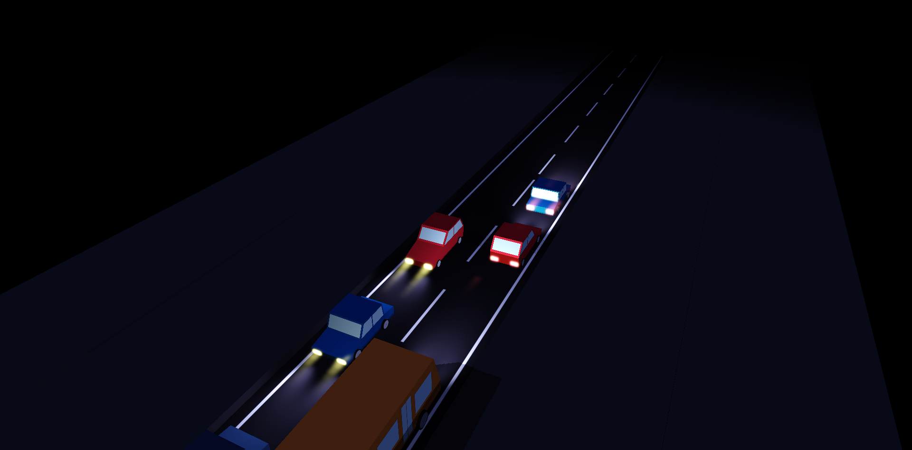
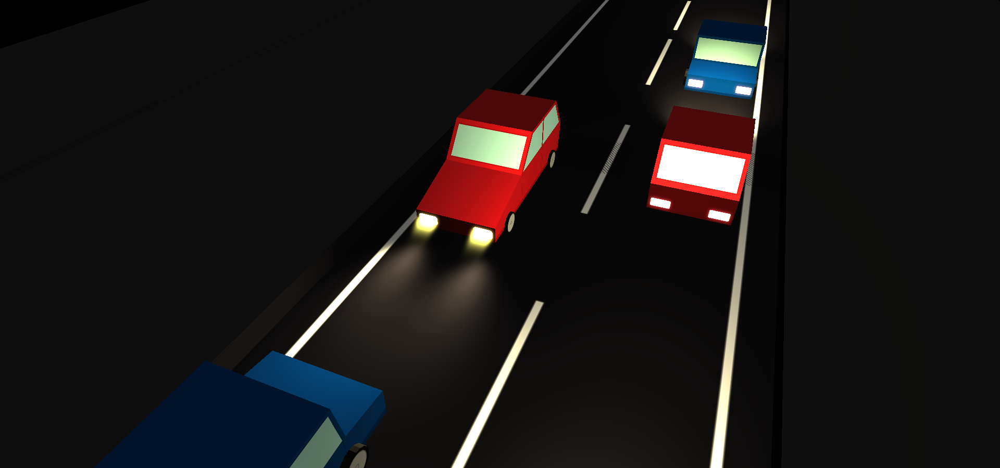
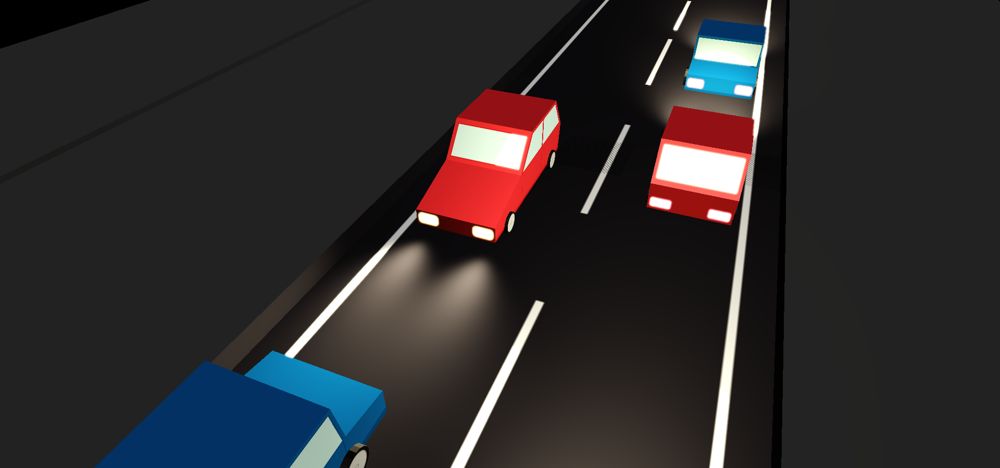
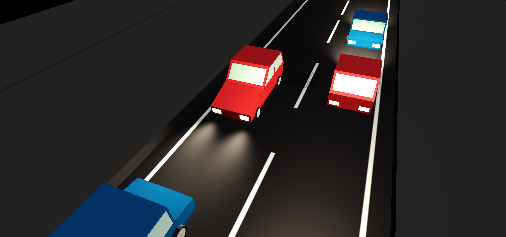
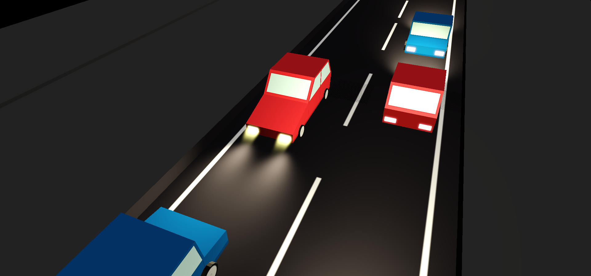
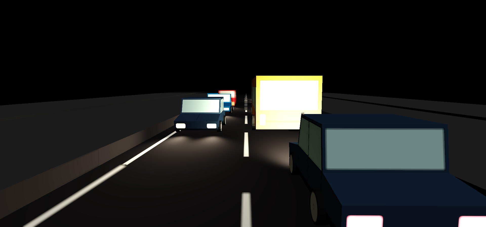
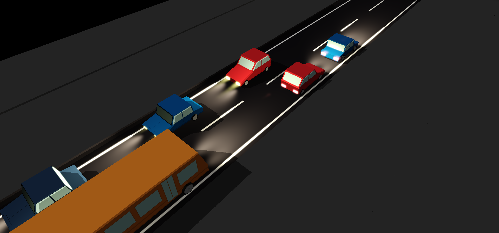
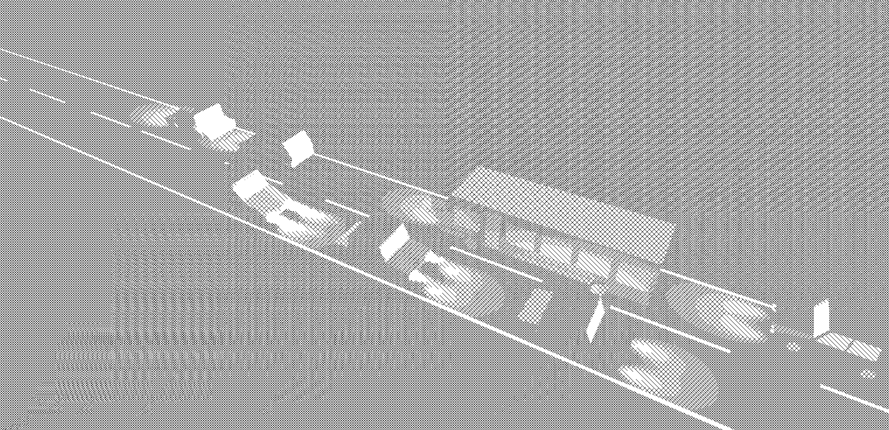

# Project 7: Deferred Renderer



I rendered a low poly highway scene. Inspired by many low poly games! I decided this would be a great way to experiment with God Rays (Instead of having the usual overhead sun like god ray), Using a similar approach I got some cool effects!

[Demo Link](https://vasumahesh1.github.io/DeferredRenderer_WebGL/)

## Controls


Almost everything is toggleable. Except for Shadow Maps. You can adjust the blending amount for each effect which affects the final Composition into the frame buffer. Use `Toggle Sky Color` if the Scene is too dark for you.

## Scene Shading

I used OpenGL Structures to send N `SpotLight`s into the buffer. I iterate over them for each pixel (which seems inefficient if N is super large). For accomplishing this I had done this previously for supporting multiple PointLights, so SpotLights weren't that hard.

```glsl
#define MAX_SPOT_LIGHTS 20
struct SpotLight {
    vec4 ambient;
    vec4 diffuse;
    vec4 specular;

    vec3 position;
    float range;
    float contrib;

    vec3 direction;
    float kSpot;

    vec3 attn;
};

uniform SpotLight u_SpotLights[MAX_SPOT_LIGHTS];
uniform uint u_NumSpotLights;
```

Later for Binding, inside `Spotlight` Class I bind then in an array fashion that matches these exact attributes.

Other than that, I have Blinn Phong, but with some texture maps and emissive maps. I use emissive maps during blur from bloom.

I have a directional light used as the Moonlight / Sunlight from the sky.

## Tonemapping

I used tonemapping from [Filmic Worlds blog](http://filmicworlds.com/blog/filmic-tonemapping-operators/).

| With Tonemap | Without Tonemap |
| ---- | ---- |
|  |  |


## Bloom

The following process is used for Bloom.

```
Bloom Extract -> Bloom Blur X -> Bloom Blur Y -> Composite
```


| With Bloom | Without Bloom |
| ---- | ---- |
|  |  |

## God Rays

My god rays implementation is similar to the one from [GPU Gems](https://developer.nvidia.com/gpugems/GPUGems3/gpugems3_ch13.html). There is a slight difference, the one in GPU gems takes a delta from light position in Screen space, but since my lights are spot lights, I now use the direction vector from my spot light as the "marcher". It works pretty well! There are still some limitations as, I was using more than one light, so I needed some boundary condition to prevent god rays from invalid sources. This works pretty well, but fails when the boundary condition of one light overlaps with other lights eg: watching them headon. But, a nice top down view like in a game, procduces the correct effect!

| With God Rays | Without God Rays |
| ---- | ---- |
|  |  |

## Depth of Field

I used an approach from (the metal gear graphics study)[http://www.adriancourreges.com/blog/2017/12/15/mgs-v-graphics-study/]. They split the frame into near field and far field. I did a similar approach where I divided the frame into 3 parts: Near Field, In Focus, Far Field. Then I blur the two(Near & Far) fields and composite them. This result is decent, can be improved. There are some seams that are undesirable.

| With God Rays |
| ---- |
|  |

## Shadow Mapping

Integrated the Shadow maps into the pipeline. There was a nice issue I spotted, If I used the default code then shadow maps don't work, because since it is a depth-based effect, one has to attach a depth texture in order to tell OpenGL to do depth sorting.



## Cartoon Like Hatching

I made a procedural cartoon like hatching effect as post process. The effect was made from luminance thresholding and modulating for getting the repeats.

| Hatching |
| ---- |
|  |


## Other Features

- Distance based exponential fog
- Emissive Maps
- Custom Scene with Custom Textures

